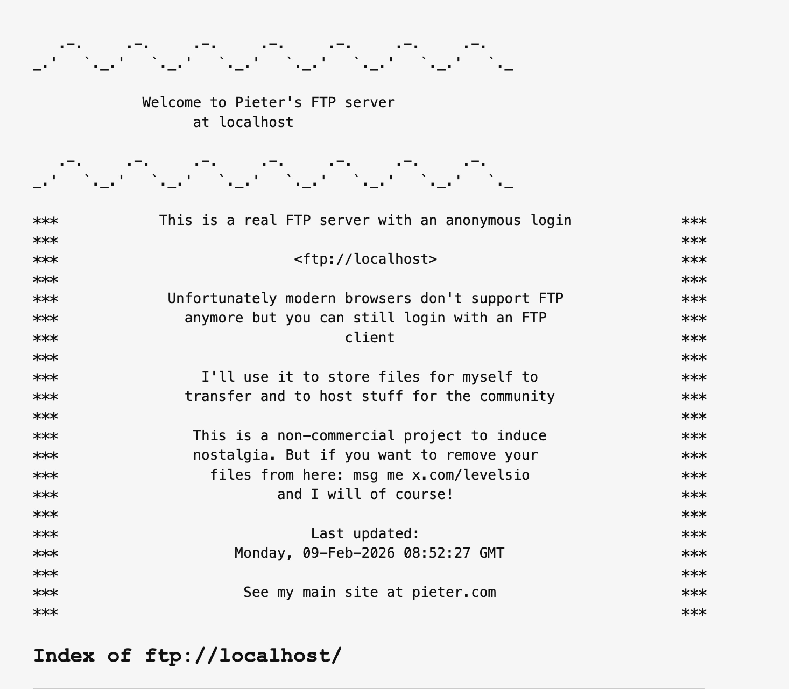
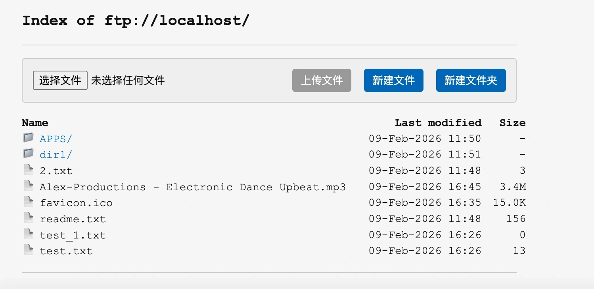

# FTP Server v2

复刻 [Pieter's FTP](https://ftp.pieter.com/) 风格：**真实 FTP 服务 + 同风格 Web 目录索引**，共用同一数据目录。

## 功能

- **FTP**：匿名登录，列表/上传/下载，端口可配置（默认 2121）
- **HTTP 目录索引**：ASCII 横幅 + 信息框（*** 区域）+ 目录/文件列表，等宽字体，响应式布局
- **Web 上传**：选择文件后「上传文件」可用，支持多文件上传（最多 10 个，单文件最大 100MB），上传后刷新当前目录
- **新建文件**：弹框输入文件名与可选内容，在当前目录创建文件
- **新建文件夹**：弹框输入文件夹名，在当前目录创建目录（同名目录返回错误提示）
- **文件下载**：支持中文等文件名（URL 解码），流式下载
- **Favicon**：若 `data/` 目录下存在 `favicon.ico`，自动使用
- **安全防护**：路径严格校验（禁止 `..` 逃逸），文件名清理（移除空字节）
- 站点名、FTP 地址、说明文案通过 `.env` 配置；开发时 `npm start` 带 nodemon 自动重启

## 预览

### 主页面


### 新建文件夹弹窗


## 快速开始

```bash
cp .env.example .env   # 可选
npm install
npm start              # 带 nodemon，改代码自动重启
```

- 浏览器：http://localhost:3000  
- FTP 客户端：`ftp://localhost:2121`，用户 `anonymous`，密码任意

## 配置（.env）

| 变量 | 说明 | 默认 |
|------|------|------|
| FTP_PORT | FTP 端口 | 2121 |
| HTTP_PORT | HTTP 端口 | 3000 |
| DATA_ROOT | 数据根目录（与 FTP 共用） | ./data |
| SITE_NAME | 站点名（标题用） | Pieter |
| FTP_HOST | 索引页显示的 FTP 地址 | localhost |

## 目录结构

```
ftp-server-v2/
├── config.js              # 配置入口
├── src/
│   ├── index.js           # 启动 FTP + HTTP
│   ├── ftp/server.js      # FTP 服务（ftp-srv）
│   └── http/
│       ├── server.js       # Express：索引、上传、新建文件/文件夹、文件下载
│       ├── indexPage.js    # 索引页 HTML 与弹框
│       └── format.js       # 日期/大小/路径/欢迎框格式化
├── data/                  # 默认数据目录（自动创建，.gitignore 忽略内容）
├── docs/
│   └── DESIGN.md          # 方案设计
├── README.md
├── CHANGELOG.md
└── .env.example
```

## 脚本

| 命令 | 说明 |
|------|------|
| `npm start` | 使用 nodemon 启动，监听 `src/`、`config.js`、`.env` 自动重启 |
| `npm run serve` | 单次启动，不监听文件变化 |

## 生产部署

- FTP 使用 21 端口需 root 或 `setcap cap_net_bind_service=+ep $(which node)`
- HTTP 可前挂 Nginx/Caddy 做反向代理与 HTTPS

## 参考

- 方案设计：见 [docs/DESIGN.md](docs/DESIGN.md)
- 参考站点：https://ftp.pieter.com/

## License

MIT License - 详见 [LICENSE](LICENSE) 文件
